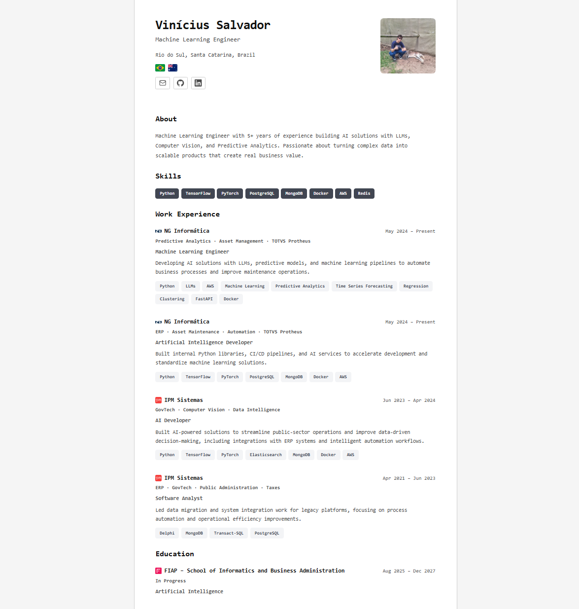

# minimalist CV

Minimal personal resume template built with plain HTML, CSS, and JavaScript. Easy to customize and deploy.



## How to use

This repository is a reusable resume template. Your personal data should go in `cv.js`, which is ignored by Git. You can keep your personal data private in your own repo.

### 1. Use the template

- Copy `cv.example.js` to `cv.js`
- Fill in your own information in `cv.js`
- Replace `assets/images/photo.jpg` with your own photo if desired

If you want to keep your personal data private in your own repo, do not commit `cv.js`.

### 2. Preview locally

The app uses native ES modules (`<script type="module">`), so opening `index.html` directly (`file://`) won't work - browsers block module imports over the `file://` protocol. Serve the folder over HTTP instead, e.g. with Node (no install needed):

```bash
npx serve .
```

Then open the printed URL (usually `http://localhost:3000`).

### 3. Deploy for free

Any static hosting service works, giving some personal options:

| Service | How to deploy |
|---|---|
| **GitHub Pages** | Push the repo and enable Pages in the repo settings |
| **Vercel** | Run `npx vercel` in the project folder |

---

## Project structure

```
minimalist-cv/
├── assets/       # Images and static assets
├── index.html    # HTML shell (usually no changes needed)
├── src/
│   ├── data/
│   │   ├── cv.js          # Your personal data (local/private)
│   │   └── cv.example.js  # Template example for other users
│   ├── styles/
│   │   └── style.css      # Visual styles
│   ├── components/        # One renderer per CV section (header, about, skills, ...)
│   ├── utils/              # DOM and date helpers
│   └── app.js              # Entry point: bootstraps theme + renders components
├── gitignore
├── LICENSE
├── README.md
```


## Available sections

| Field in `cv.js` | Rendered section |
|---|---|
| `about` | About |
| `skills` | Skills |
| `languages` | Languages |
| `experience` | Experience |
| `education` | Education |
| `projects` | Projects |
